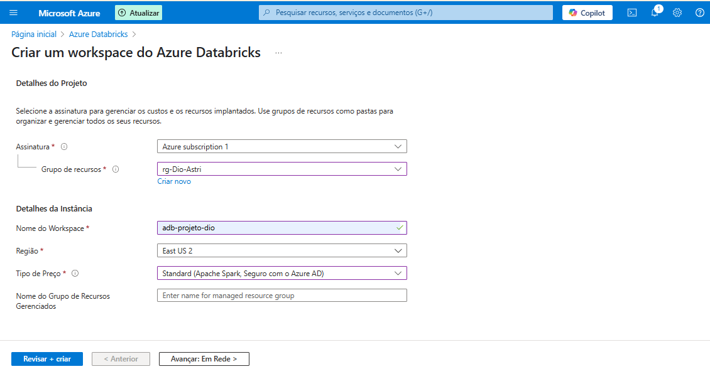
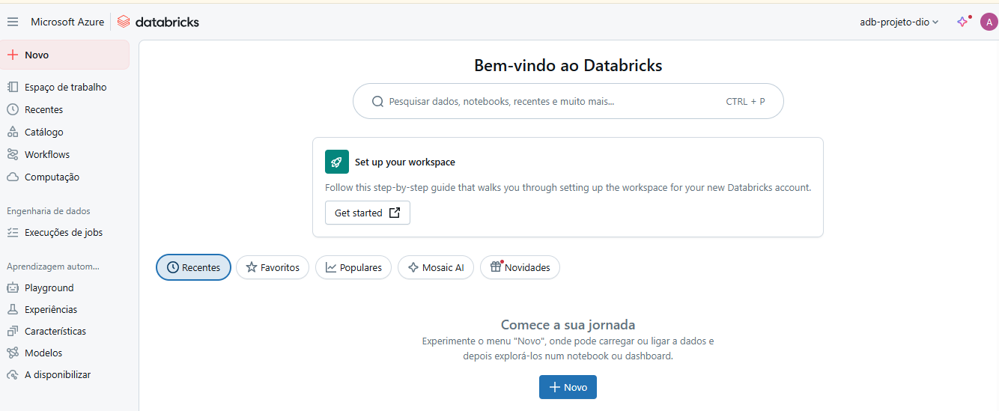
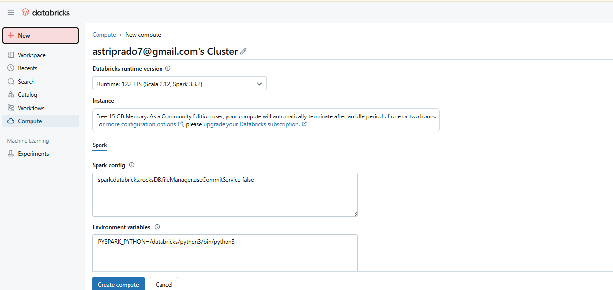
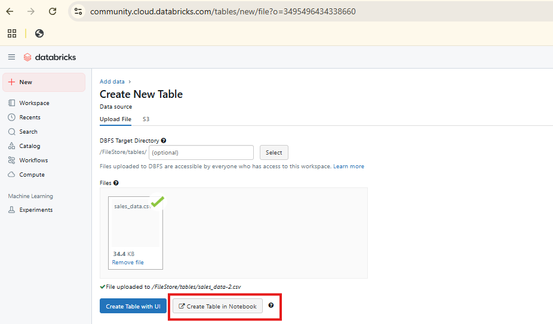
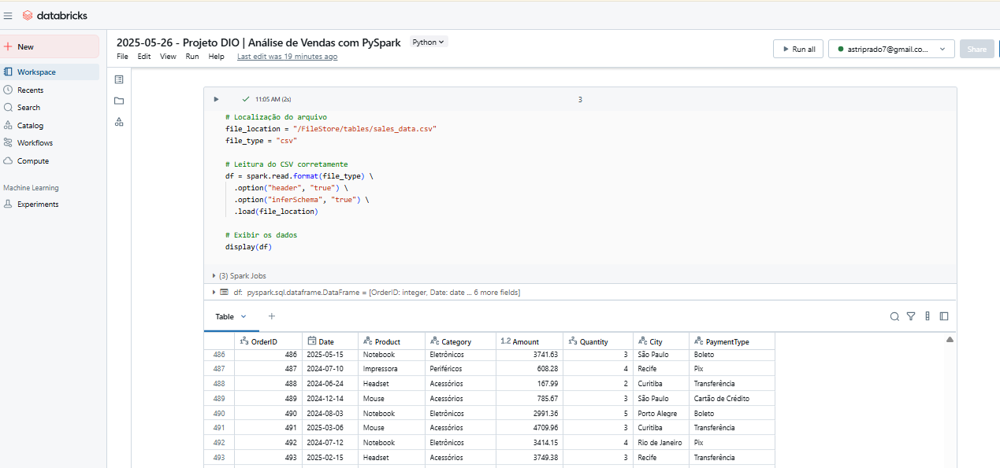
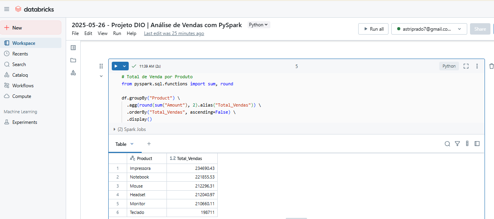
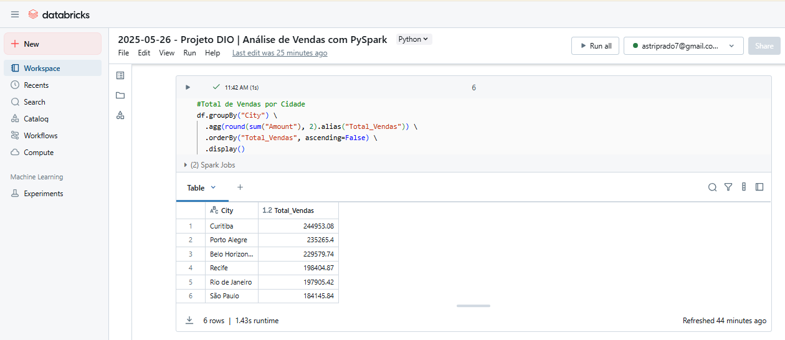
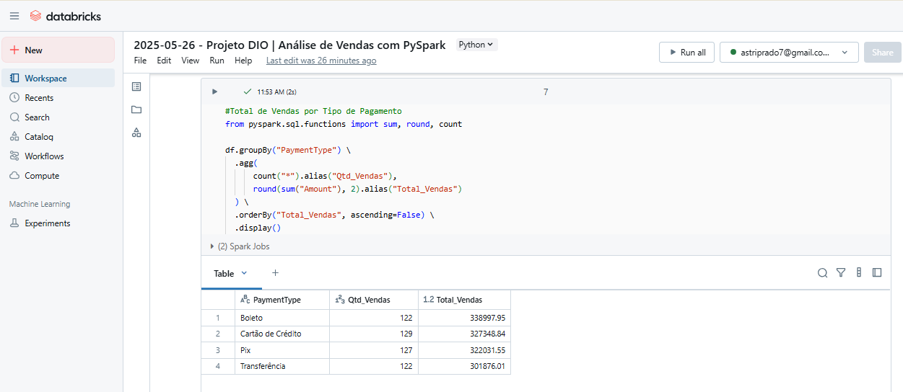
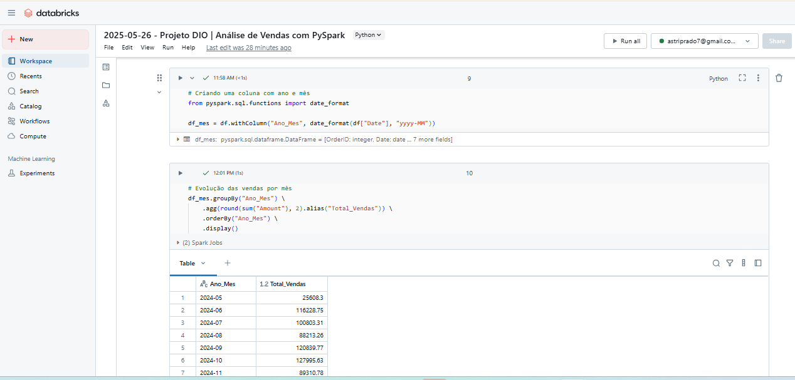

# 🚀 Projeto de Análise de Dados com Azure Databricks e Spark

Este projeto foi desenvolvido como parte do **Bootcamp Microsoft AI - Azure Databricks**. O objetivo é provisionar um ambiente Databricks no portal Azure, criar um cluster e utilizar o **Spark** para realizar uma análise de dados.

---

## 🔧 Etapas do Projeto

### 1️⃣ Provisionando o Azure Databricks

- Acesse o portal do [Azure](https://portal.azure.com).
- Busque por **Databricks** no menu de recursos.
- Clique em **Criar** e preencha as informações necessárias.
- Clique em **Revisar + Criar** e depois em **Criar**.

---

### 2️⃣ Acessando o Workspace do Databricks

- Após a implantação, clique em **Ir para o recurso**.
- Selecione **Iniciar workspace** para abrir o ambiente do Databricks.

---

### 3️⃣ Criando um Cluster (Versão Community)

- No menu lateral, clique em **Compute**
- Clique em **Create Compute**.
- A versão **Community** tem limitações, mas atende bem para projetos de estudo.

---

### 4️⃣ Criando um Notebook

- O Notebook foi criado ao subir o arquivo CSV para análise.
- Dataset utilizado: **sales_data**.

---

## 🔍 Análise de Dados com PySpark

🔸 **Leitura do arquivo CSV**

🔸 **Análise das Vendas por Produto**

🔸 **Análise das Vendas por Cidade**

🔸 **Análise das Vendas por Forma de Pagamento**

🔸 **Evolução das Vendas por Mês**

---

## 🧠 Tecnologias e Ferramentas

- 🔹 Microsoft Azure
- 🔹 Azure Databricks
- 🔹 Apache Spark
- 🔹 PySpark
- 🔹 Python
- 🔹 Git & GitHub

---

## 👩‍💻 Autor(a)

**Astri Prado** — [@SeuUsuarioGitHub](https://github.com/AstriPrado)  
Projeto realizado como parte do **Bootcamp Microsoft AI - Azure Databricks**.

---

## ✅ Observações

- Optei por incluir apenas os prints dos códigos no README para mantê-lo mais leve e objetivo.
- A análise foi realizada na versão **Community** do Databricks, mas o README traz também o passo a passo para configuração via Azure.
